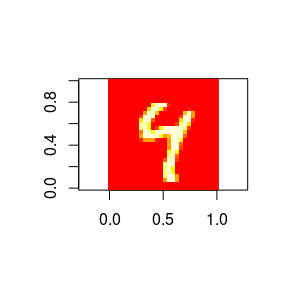
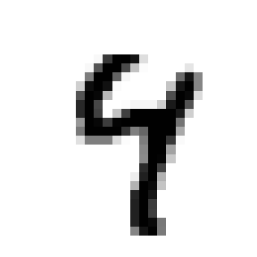

tensorflow test
================

Download the mnist data set

``` r
library(tensorflow)

# Load mnist data
datasets <- tf$contrib$learn$datasets
mnist <- datasets$mnist$read_data_sets("MNIST-data", one_hot = TRUE)
```

Images are 28 by 28 pixels. We have lots of them

``` r
# Training, testing, validation sets
nrow(mnist$train$images)
#> [1] 55000
nrow(mnist$test$images)
#> [1] 10000
nrow(mnist$validation$images)
#> [1] 5000

# one hot encoding of labels
lab_image1 <- mnist$train$labels[3, ]
lab_image1
#>  [1] 0 0 0 0 1 0 0 0 0 0

# Preview one of the items
image1 <- mnist$train$images[3, ]
m_image1 <- matrix(image1, ncol = 28, nrow = 28, byrow = TRUE)

# rotate 45 degrees
m_image1 <- t(m_image1[28:1, ])

image(m_image1, useRaster = TRUE, asp = 1)
```



``` r
# ugh those margins. just use ggplot2, even though we have to make this a long 
# dataframe
library(ggplot2)
library(dplyr)
#> 
#> Attaching package: 'dplyr'
#> The following objects are masked from 'package:stats':
#> 
#>     filter, lag
#> The following objects are masked from 'package:base':
#> 
#>     intersect, setdiff, setequal, union

df <- m_image1 %>% 
  tibble::as_tibble() %>% 
  setNames(1:28) %>% 
  tibble::rownames_to_column("x") %>% 
  tidyr::gather(y, z, -x) %>% 
  readr::type_convert() 
#> Parsed with column specification:
#> cols(
#>   x = col_integer(),
#>   y = col_integer()
#> )

ggplot(df) + 
  aes(x, y, fill = z) + 
  geom_raster() + 
  scale_fill_continuous(low = "white", high = "black") + 
  guides(fill = FALSE) +
  coord_equal(ratio = 1, expand = FALSE) + 
  theme_void()
```



``` r
# Create the model
x <- tf$placeholder(tf$float32, shape(NULL, 784L))
W <- tf$Variable(tf$zeros(shape(784L, 10L)))
b <- tf$Variable(tf$zeros(shape(10L)))

y <- tf$nn$softmax(tf$matmul(x, W) + b)

# Define loss and optimizer
y_ <- tf$placeholder(tf$float32, shape(NULL, 10L))
cross_entropy <- tf$reduce_mean(-tf$reduce_sum(y_ * log(y), reduction_indices = 1L))
train_step <- tf$train$GradientDescentOptimizer(0.5)$minimize(cross_entropy)

# Create session and initialize  variables
sess <- tf$Session()
sess$run(tf$initialize_all_variables())


# Train
for (i in 1:1000) {
  batches <- mnist$train$next_batch(100L)
  batch_xs <- batches[[1]]
  batch_ys <- batches[[2]]
  sess$run(train_step,
           feed_dict = dict(x = batch_xs, y_ = batch_ys))
}

# Test trained model
correct_prediction <- tf$equal(tf$argmax(y, 1L), tf$argmax(y_, 1L))
accuracy <- tf$reduce_mean(tf$cast(correct_prediction, tf$float32))
sess$run(accuracy,
         feed_dict = dict(x = mnist$test$images, y_ = mnist$test$labels))
```
