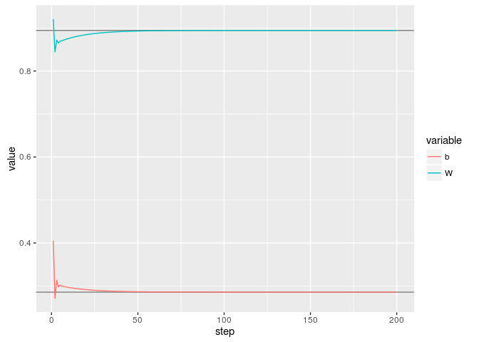

tensorflow test
================

Test the installation.

``` r
library(tensorflow)
sess <- tf$Session()
sess
#> <tensorflow.python.client.session.Session object at 0x7faf59565a20>

hello <- tf$constant('Hello, TensorFlow!')
sess$run(hello)
#> b'Hello, TensorFlow!'
```

Fit a two-dimensional line. I modified the RStudio demo so the slope and intercept are random, and I've added plot of parameter values over the course of training. This plot is a little naive, because it looks like there are native, more robust ways to log information over the course of training.

``` r
# Create 100 phony x, y data points, y = x * slope + intercept
slope <- runif(1, min = .1, max = .9)
slope
#> [1] 0.8944566

intercept <- runif(1, min = .1, max = .9)
intercept
#> [1] 0.2855816

x_data <- runif(100, min = 0, max = 1)
y_data <- x_data * slope + intercept

# Try to find values for W and b that compute y_data = W * x_data + b
W <- tf$Variable(tf$random_uniform(shape(1L), -1.0, 1.0))
b <- tf$Variable(tf$zeros(shape(1L)))
y <- W * x_data + b
y
#> Tensor("Add:0", shape=(100,), dtype=float32)

# Minimize the mean squared errors.
loss <- tf$reduce_mean((y - y_data) ^ 2)
loss
#> Tensor("Mean:0", shape=(), dtype=float32)
optimizer <- tf$train$GradientDescentOptimizer(0.5)
train <- optimizer$minimize(loss)
train
#> name: "GradientDescent"
#> op: "NoOp"
#> input: "^GradientDescent/update_Variable/ApplyGradientDescent"
#> input: "^GradientDescent/update_Variable_1/ApplyGradientDescent"

# Launch the graph and initialize the variables.
sess <- tf$Session()
sess$run(tf$initialize_all_variables())

# Fit the line, storing intermediate results to a list
library(purrr)
n_steps <- 200
results <- n_steps %>% seq_len %>% as.list

# Use for loop because sess$run(train) updates a global object, I think.
for (step in seq_len(n_steps)) {
  sess$run(train)
  
  if (step %% 20 == 0) { 
    cat(step, "-", sess$run(W), sess$run(b), "\n")
  }
  
  results[[step]] <- list(
    step = step, 
    W = sess$run(W),
    b = sess$run(b))
}
#> 20 - 0.8845426 0.2914276 
#> 40 - 0.8916417 0.2872415 
#> 60 - 0.8936573 0.2860529 
#> 80 - 0.8942297 0.2857155 
#> 100 - 0.8943921 0.2856196 
#> 120 - 0.8944383 0.2855924 
#> 140 - 0.8944514 0.2855847 
#> 160 - 0.8944551 0.2855825 
#> 180 - 0.8944562 0.2855819 
#> 200 - 0.8944563 0.2855818

df_results <- dplyr::bind_rows(results) %>% 
  tidyr::gather(variable, value, -step)

library(ggplot2)

ggplot(df_results) + 
  aes(x = step, y = value, color = variable) + 
  geom_hline(yintercept = c(slope, intercept), color = "grey50") +
  geom_line()
```


